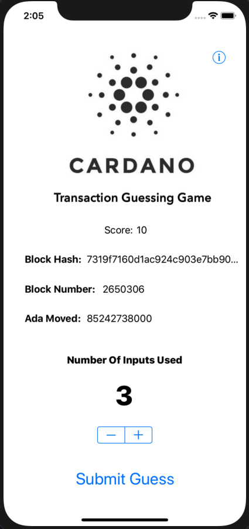
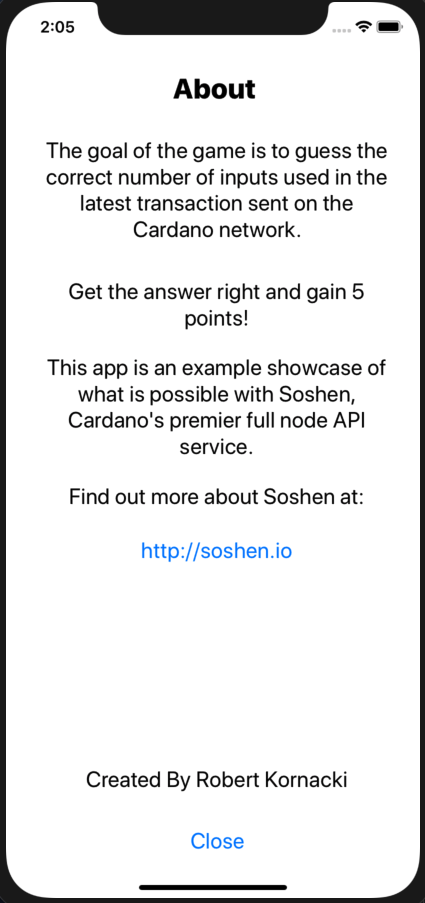

# iOS Cardano Guessing Game

## [Youtube Video Showing The App Off](http://www.youtube.com/watch?v=x-Z1c8UFUOI "Video Title")

This is a small example iOS app using [Soshen](http://soshen.io). It was very easy to develop especially thanks to the fact that Soshen has the ability to stream new transactions to your app via WebSockets.

If you wish to run the app yourself then clone the repo, sign up for a Soshen account, and fill in the url with your info on line 14 of `ViewController.swift` in the `WebSocket` initialization.

The code is distributed with the MIT License so feel free to go crazy with it.
